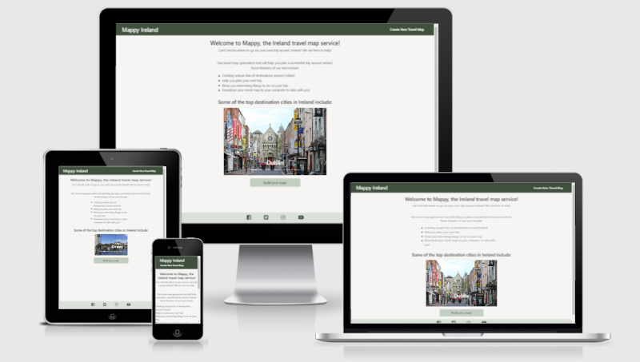
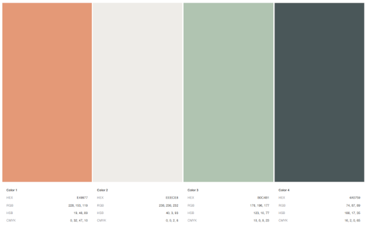
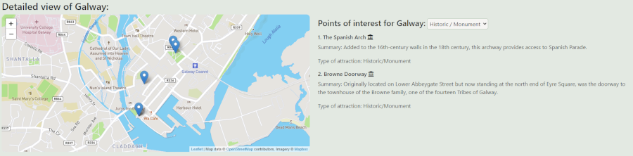

# Milestone Project Two - Mappy



The purpose of this website is to provide users with a map of cities to visit in Ireland, along with selected points of interest for each city.  The tool will generate a randomized list of cities including two, three or four primary destinations as results, based on user selection.  The user can then drill down into each destination to view a list of selected points of interest, which they can then filter by 'cateogry' to further refine their trip.

[View the live project here.](https://michaelhesch.github.io/ci-ms-2/)

---

## User Experience (UX) - TBU

### User stories - TBU

#### First Time Visitor Goals

- As a first time visitor

  - Learn about x.

  - Learn about x.

  - Learn about x.

#### Returning Visitor Goals

- As a returning visitor

  - x.

  - x.

  - x.

#### Site Owner Goals

- As the site owner

  - x.

  - x.

  - x.

### Design - TBU

#### Colour Scheme

- The page color scheme is based on subdued green, gray-green and orange tones.  The theme is meant to reference variatiosn of the colors of the Irish flag.

- A light neutral gray-green background color [#F6F5F3] was selected to create a clean and simple backdrop which would not distract from the content of the page.  

- Orange [#B55224] was used as the highlight color only to clearly draw the user's attention to a hover over or click on a clickable selection.  

- Shades of green were employed for the navigation bar [#3C503D], the footer [#3C503D], button backgrounds [#BACBBB] and content containers [#E2E9E2].

- Primary colour palette selected for the site from [Coolors](https://coolors.co/):

    

- The full palette containing all colors used in the site can be found [here.](documentation/MappyPalette.pdf)

#### Typography

- The font used throughout the site is the Google Font 'Open Sans' which is a clean and simple font style that is easy to read across font sizes.  This font was selected to further build a clean and simple aesthetic across the content on the site.  Sans-serif serves as the backup to Open Sans if it fails to load.

#### Imagery

- The landing page image carousel serves a series of images of cities that are included in the Mappy generation database.  This serves to draw the user's attention and create excitement for visiting cities included when using the tool.

### Wireframes - TBU

- Mobile Wireframes - [View](documentation/wireframes/mobile-wireframe.pdf)

- Tablet Wireframes - [View](documentation/wireframes/tablet-wireframe.pdf)

- Desktop Wireframes - [View](documentation/wireframes/desktop-wireframe.pdf)

#### Deviations from wireframe designs

- During development some small changes were made to the final design that is deployed vs. the wireframes above:

  - Removal of the "Print Map" button & associated feature.  This was removed to reduce complexity for the initial release of the page, this may be added in through a future update.

  - Addition of coloured "tile" background to hold the map output and map drilldown output content.  This was added to give some additional visual focus to the main content a user will interact with on the page, and to distinguish the maps and associated details from the background of the site.

  - Added headings to the top map section and the details map below, which is updated dynamically to show the name of the city a user has selected.

## Features - TBU

- Clear and concise landing page.

- Distinct button on the landing page to launch the map creation tool.

- Clear and uncluttered map creation page with simple to use controls.

- Easy to read maps and clear details on points of interest.

## Technologies Used - TBU

### Programming Languages Used

- [HTML5](https://en.wikipedia.org/wiki/HTML5)
- [CSS3](https://en.wikipedia.org/wiki/Cascading_Style_Sheets)
- [JavaScript](https://en.wikipedia.org/wiki/JavaScript)

### Frameworks, Libraries & Programs Used - TBU

1. [Leaflet.js](https://leafletjs.com/)
    - Leaflet was used to generate mobile friendly and efficient maps and to attach point of interest markers to the maps generated in this project.  Attribution for Leaflet can also be found on the maps embedded in the page.
1. [Mapbox](https://docs.mapbox.com/api/overview/)
    - Mapbox was used in conjunction with Leaflet to provide the image tiles utilized by the Leaflet maps.  Attribution for Mapbox can also be found on the maps embedded in the page.
1. [Bootstrap 5.0.1](https://getbootstrap.com/docs/5.0/getting-started/introduction/)
    - Bootstrap was used to add responsiveness and provide a simplified grid construction method.  In addition I utilized Bootstrap to create a sticky footer bar and image carousel for the site's landing page.
1. [Google Fonts:](https://fonts.google.com/)
    - Google fonts were used to import the 'Open Sans' font into the style.css file which is used on all pages throughout the project.
1. [Font Awesome:](https://fontawesome.com/)
    - Font Awesome was used to add a visual identifier for the type of point of interest for the maps page, and for the social media links found in the footer of all pages.
1. [Coolors:](https://coolors.co/)
    - Used Coolors to select the color palette for the page.  Selected color palette can be viewed [here](https://github.com/michaelhesch/ci-ms-2/tree/master/documentation/MappyPalette.pdf).
1. [Code Institute Full-Stack Developer Course](https://www.codeinstitute.net/)
    - Code snippets were referenced for styling various elements of the site, and organization of the social media links footer section.
1. [Balsamiq:](https://balsamiq.com/)
    - Balsamiq was used to create the design wireframes used to outline the webpage before development.
1. [GIMP:](https://www.gimp.org/)
    - GIMP (GNU Image Manipulation Program) is a free and open source image editor, used to resize and adjust the images used on the site for better performance.
1. [Visual Stuido Code:](https://code.visualstudio.com/)
    - Visual Stuido code was used as the desktop development IDE for the project, managing the code and assets for the page during development.
1. [Visual Studio Code - JSHint Plugin:](https://jshint.com/about/)
    - JSHint plugin was utilized throughout the development process to help catch typographic errors and other potential issues as code was being written.
1. [Git:](https://git-scm.com/)
    - Git was used for version control by utilizing the Windows command prompt/terminal interface to commit and push to GitHub.
1. [GitHub:](https://github.com/)
    - GitHub is used to store the project's code after being pushed from the local development machine using Git, as well as host the page using GitHub Pages.

## Testing - TBU

### Code Validation

The W3C Markup Validator and W3C CSS Validator Services were used to validate every page of the project to ensure there were no syntax errors in the project.  Results of those checks are documented in PDFs included in the project repository and can be accessed by following the links below.

- [W3C Markup Validator](https://validator.w3.org/nu/) - No errors detected. [Results](https://)
- [W3C CSS Validator](https://jigsaw.w3.org/css-validator/) - No errors detected. [Results](https://)
- [JSHint JavaScript Validator](https://jshint.com/) - JSHint web version produces warnings when validating the code, while the IDE plug-in version of JSHint used during development returns no outstanding warnings.  This difference is due to the web version lacking the full context of references to outside files, functions called from HTML, etc.  During testing no unexpected behavior or bugs have been detected related to these warnings.  Descriptions of the outstanding warnings can be found below:
  
1. Three undefined variables
    1. "L" : this is a reference to the Leaflet JS library, which is required to call Leaflet functions/methods from Leaflet.  My implementation of "L" is consistent with the Leaflet documentation, and is contained within functions throughout my page.  The Leaflet JavaScript and CSS libraries are loaded in the project via the HTML, which is likely the cause of this warning.  A further example of how "L" is used in a function in the project:

        ```javascript
        let topMap = L.map('top-map-div', {scrollWheelZoom: false}).setView([53.2734, -7.7783], 7);

        L.tileLayer(`https://api.mapbox.com/styles/v1/{id}/tiles/{z}/{x}/{y}?access_token=${apiKey}`, {
        attribution: `${mapAttribution}`,
        id: 'mapbox/streets-v11',
        tileSize: 512,
        zoomOffset: -1
        }).addTo(topMap);
        ```

    1. "locationsArr" : this is the data source array created by the developer and used by the site's functions to populate the site with city and point of interest data, in place of a JSON response from a data service.  To keep the primary JavaScript file "main.js" neat and tidy, this array was placed in a separate JavaScript file called "data.js", which is loaded via the HTML when the maps page is opened.  As this variable is referenced in the "main.js" but is coming from an external source, this is likely the cause of this warning.
    1. "fontMapper" : this is the data source array created by the developer and used by the site's functions to populate the site with city and point of interest data, in place of a JSON response from a data service.  To keep the primary JavaScript file "main.js" neat and tidy, this array was placed in a separate JavaScript file called "data.js", which is loaded via the HTML when the maps page is opened.  As this variable is referenced in the "main.js" but is coming from an external source, this is likely the cause of this warning.

### Function Testing

The site contains 14 functions which are used to implement the dynamic functionality of the page in various ways.  During development and upon completion of the project, testing was undertaken to ensure these functions are behaving as designed.

1. mapLoader() :
1. randomizer(numOfLocations) :
1. generateCityList() :
1. generateTopMapCitiesResults() :
1. generateTopMapAndCitiesLayout(locationsList) :
1. generateFilteredAttractions(citySelectionIndex, tripType) :
1. generateDetailsDefaultLayout(citySelectionIndex) :
1. updateDetailsMapMarkers(filteredAttractions) :
1. updateDetailsViewContent(filteredAttractions) :
1. renderBottomMap(citySelection) :
1. filterDrilldown(citySelectionIndex) :
1. clearDrilldown() :
1. createDrilldownControls() :

### Testing User Stories from User Experience (UX) Section - TBU

#### First Time Visitor Story Testing

1. Learn about X.
    1. When a user arrives at the landing page of the site, they are presented with a clean and clear menu bar for navigation, featuring the name of the club, and a large hero image section to draw their attention.  
    1. The hero image also features a text tagline to further reinforce the brand of the club and further draw the user's attention.  [View Screenshot](https://github.com/)
    1. Continuing further down the page, the benefits of membership in the club are clearly featured in three large tiles with brief text descriptions of each feature. [View Screenshot](https://github.com/)

2. Learn about X.
    1. The second component of the landing page, after the club benefits, is a listing of upcoming club events by location, including day and time. [View Screenshot](https://github.com/)

3. Learn about X.
    1. Once the user navigates to the Locations tab, the club's physical locations are clearly displayed in a large grid, including the address and opening hours of each location, as well as a map to help the user visualize the location in each city. [View Screenshot](https://github.com/)

#### Returning Visitor Story Testing

1. X.
    1. After a user visits the page and learns more about the club, they may want to return to submit an application.  This is accomplished by navigating to the "Join the Club" page and filling out a form to collect the user's basic details.  [View Screenshot](https://)
    1. In addition, the user can select their desired membership level from two options, standard & premium, based on the features of each level displayed in the form. [View Screenshot](https://)

2. X.
    1. The club events highlight section on the landing page would be updated rountinely by the club as new events are held, and as time passes, so this section will provide a quick and easy reference point for a returning user to view events. [View Screenshot](https://)

3. X.
    1. As the club expands, users can easily view newly added locations on the "Locations" tab of the page, which would be updated to include the address and opening hours details for new club locations. [View Screenshot](https://)

#### Site Owner Story Testing

1. X.
    1. After a

### Further Testing - TBU

#### Responsiveness

- All pages were tested for responsiveness and any visible bugs using Google Chrome developer tools to change the viewing size across all device sizes offered.  In addition, all pages on the site were tested for correct behavior on a 27" desktop monitor, a 15.1" laptop monitor, an iPhone 11 and a 10.5" iPad.  The pages scale and respond as expected for a normal user experience across these viewing sizes & devices.

#### Lighthouse

- The Lighthouse tool in Chrome Developer tools was used to generate performance scores and identify areas for improvement in both mobile and desktop views of the page.  Results of this scoring can be viewed via the links below:

    1. Mobile Scores:
        1. [Home Page](https://)
        1. [Map Generation Page](https://)
    1. Desktop Scores:
        1. [Home Page](https://)
        1. [Map Generation Page](https://)

- Please note that while efforts to coprrect some defects indicated in these results are due to issues found in external dependencies, such as Bootstrap's CSS, the HTTP version configured in the GitHub Pages server that the site is deployed on, etc. or other faults that are beyond the scope of this project to remedy.

### Issues Encountered in Development - TBU

- [Resolved] x
- [Open] Reusability of map configuration data - When placing the base map tile configuration below into a variable, with the goal of re-using this code throughout the project to improve maintainability and simplify the code overall, the map does not behave as intended when tested in the browser.  The result is the map not rendering correctly, and rapidly zooming over and over to the intended marker location.  Investigation into this is ongoing but for the time being, the original working code format is being used, where this layer setup is repeated for each instance of a map being rendered.

    ```javascript

    L.tileLayer('https://api.mapbox.com/styles/v1/{id}/tiles/{z}/{x}/{y}?access_token=pk.[apikeyplaceholder]', {
    attribution: 'Map data &copy; <a href="https://www.openstreetmap.org/copyright">OpenStreetMap</a> contributors, Imagery © <a href="https://www.mapbox.com/">Mapbox</a>',
    id: 'mapbox/streets-v11',
    tileSize: 512,
    zoomOffset: -1}

    ```

- [Open] Map marker clearing - Ongoing issue related to how the Leaflet maps consume point of interest coordinates to set map markers.  Attempted several potential solutions to loop through the currently set markers and/or marker layers to remove them when the POI list is filtered, however based on my investigations the way the markers are being set to the map when it is intilized will not allow this to work.  Extensively read the API documentation from Leaflet and Mapbox but have not been able to produce a solution to this yet.  Below is an example where only two markers should be visible, however all markers can be seen as they are all contained within the allMarkers default drill-down zoom level.

    

## Deployment

### GitHub Pages

The project was deployed to GitHub Pages using the following steps:

1. Log in to GitHub and locate the [GitHub Repository](https://github.com/michaelhesch/ci-ms-2/)
2. From the Repository menu, select "Settings" at the far right of the menu bar.
3. Scroll down the Settings page and select the "Pages" option.
4. Under "Source", click the dropdown and select "Main" to select the main branch of the project.  Press "save".
5. The page will automatically refresh.
6. The site has now been published and GitHub will display the [link](https://michaelhesch.github.io/ci-ms-2/) in a green box.

### Making a Local Clone

1. Log in to GitHub and locate the [GitHub Repository](https://github.com/michaelhesch/ci-ms-2/)
2. Under the repository name, click "Code", then select the clipboard icon under "Clone with HTTPS" to copy the link.
3. Open Git Bash
4. Change the current working directory to the location where you want the cloned directory.
5. Type `git clone`, and then paste the URL you copied in Step 2 in place of the URL in quotes below.

    ```git

    # git clone "https://github.com/YOUR-USERNAME/YOUR-REPOSITORY"
    
    ```

6. Press Enter. Your local clone will be created.

    ```git
    
    # git clone "https://github.com/YOUR-USERNAME/YOUR-REPOSITORY"
    > Cloning into `Test-Clone`...
    > remote: Counting objects: 10, done.
    > remote: Compressing objects: 100% (8/8), done.
    > remove: Total 10 (delta 1), reused 10 (delta 1)
    > Unpacking objects: 100% (10/10), done.
    
    ```

Click [Here](https://help.github.com/en/github/creating-cloning-and-archiving-repositories/cloning-a-repository#cloning-a-repository-to-github-desktop) to visit GitHub Help for more detailed explanations of the cloning process.

## Credits - TBU

### Code

- [Code Institute Full-Stack Developer Course](https://www.codeinstitute.net/) : Code snippets were referenced for styling various elements of the site, and organization of the social media links footer section.

- [README Template](https://github.com/Code-Institute-Solutions/SampleREADME) : Template for the README.md file for this project was sourced from Code Institute.

- [Bootstrap Documentation](https://getbootstrap.com/docs/5.0/components/carousel/) : Code snippets taken from the offical Bootstrap reference materials to create the image carousel featured on the landing page for the site.

- [w3schools.com - Bootstrap:](https://www.w3schools.com/bootstrap4/default.asp) : Referenced w3schools materials on JavaScript to review & learn more about certain JavaScript function methods (array filtering, for example).  Also utilized to review additional documentation on CSS as well as Bootstrap features, in addition to the Bootstrap documentation.

- [Leaflet.js Quick Start Guide](https://leafletjs.com/examples/quick-start/) : Guide used to inlcude necessary Leaflet CSS and JavaScript tags, as well as the code to create the map and create the basic map tile layer.  This guide was also used to create the map marker and marker detail pop-up code adapted for use in the Mappy project.

    For example - basic map tile initilization code used from the guide below

    ```javascript

    # L.tileLayer('https://api.mapbox.com/styles/v1/{id}/tiles/{z}/{x}/{y}?access_token={accessToken}', {
    attribution: 'Map data &copy; <a href="https://www.openstreetmap.org/copyright">OpenStreetMap</a> contributors, Imagery © <a href="https://www.mapbox.com/">Mapbox</a>',
    maxZoom: 18,
    id: 'mapbox/streets-v11',
    tileSize: 512,
    zoomOffset: -1,
    accessToken: 'your.mapbox.access.token'
    }).addTo(mymap);
    
    ```

- [Leaflet.js API documentation](https://leafletjs.com/reference-1.7.1.html) : Leaflet API documentation referenced for further detail on methods to manipulate the maps used in the project.

- [Stack Overflow - Sticky Footer Solution](https://stackoverflow.com/questions/20657599/footer-in-bootstrap-that-extends-with-content-or-sticks-to-the-bottom) : Utilized method provided by user "Zim" to create a wrapper tag for main content container in index.html and applied corresponding CSS properties to get sticky footer bar for the site's social media links working correctly.

- [w3schools.com - JavaScript:](https://www.w3schools.com/jsref/jsref_reference.asp) : Referenced w3schools materials on JavaScript to review & learn more about certain JavaScript function methods (array filtering, for example).  Also utilized to review additional documentation on CSS as well as Bootstrap features, in addition to the Bootstrap documentation.

- [w3schools.com - CSS:](https://www.w3schools.com/css/default.asp) : Referenced w3schools materials on JavaScript to review & learn more about certain JavaScript function methods (array filtering, for example).  Also utilized to review additional documentation on CSS as well as Bootstrap features, in addition to the Bootstrap documentation.

### Content - TBU

- All text content excluding city and location information was written by the developer.  

- City and points of interest descriptions were sourced from Wikipedia or Google Maps location descriptions.

- City and points of interest GPS coordinates utilized on the maps were acquired from searching for each location on [Maps.ie](https://www.maps.ie/coordinates.html).

- Map locations and points of interest were selected by the developer for demonstration purposes.  In a real-world scenario this data would be returned in a JSON response from a data service.

### Media - TBU

- All Images were sourced externally, from Wikipedia or are royalty free images from Pixabay.  Specific image credits below:

- Landing page carousel image credits:

    1. [Dublin](https://pixabay.com/photos/urban-dublin-street-landmark-5272365/) - via Pixabay

    1. [Galway](https://pixabay.com/photos/ireland-galway-nature-landscape-4586693/) - via Pixabay

    1. [Cork](https://pixabay.com/photos/cork-cork-ireland-cork-ireland-4686695/) - via Pixabay

    1. [Belfast](https://pixabay.com/photos/belfast-architecture-cutter-1532356/) - via Pixabay

    1. [Killarney](https://pixabay.com/photos/killarney-ireland-city-traffic-959325/) - via Pixabay

    1. [Kilkenny](https://pixabay.com/photos/kilkenny-ireland-castle-abbey-339160/) - via Pixabay

    1. [Donegal](https://commons.wikimedia.org/wiki/File:The_Abbey_Hotel,_The_Diamond_-_geograph.org.uk_-_1016168.jpg) - via Wikipedia

### Acknowledgements

- My Code Institute Mentor Aaron for helpful feedback on my ideas prior to development and throughout the project.
